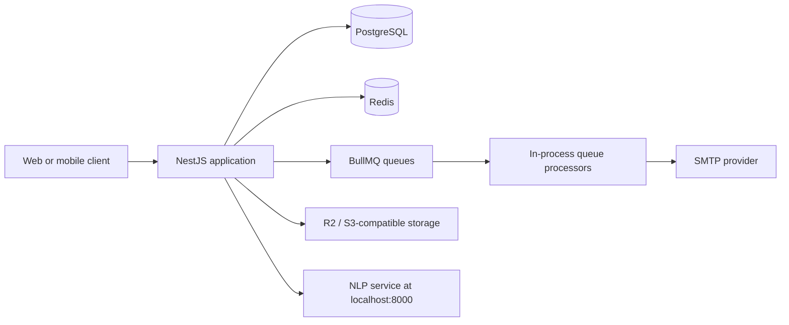

# CareerK API

CareerK is the backend for a two-sided hiring platform.

It serves two main actors:

- Job seekers who manage profiles, upload CVs, apply to jobs, bookmark jobs, run skill-gap analysis, and control notification preferences.
- Companies that manage profiles, publish direct jobs, review applications, and move candidates through the hiring pipeline.

The codebase is a NestJS application backed by PostgreSQL, Redis, BullMQ, SMTP email delivery, R2-compatible object storage for CV files, and an external NLP service for CV parsing.

This README is written for someone who needs to run the system, understand the moving parts, and make changes without guessing.

## What this repo covers

- Email verification, login, refresh-token rotation, forgot/reset password, change password, logout
- Job seeker profile management, work experience, education, skills, notification preferences
- Company profile management
- Direct job creation, publishing, pausing, closing, and company-side application review
- Public job browsing across direct jobs and scraped jobs
- Job bookmarks across both job sources
- CV upload, confirmation, parsing, preview, and persistence
- Skill-gap analysis queued in the background
- Queued email workflows for account verification, password reset, and application status updates
- Mintlify docs source under `docs/`

## Core stack

| Layer | Tooling | Notes |
| --- | --- | --- |
| HTTP API | NestJS 11 | Modular domain-based structure |
| Database | PostgreSQL + Prisma 7 | Prisma client generated into `generated/prisma` |
| Ephemeral state | Redis | Refresh token storage, OTP storage, BullMQ backend |
| Background jobs | BullMQ | Processors run in the same Nest app process |
| Email | Nodemailer | SMTP-backed email delivery |
| CV storage | S3-compatible storage | Config uses `R2_*` environment variables |
| CV parsing | External NLP service | Current code expects `http://localhost:8000/parse-cv` |
| Validation | class-validator / class-transformer | Global Nest validation pipe |
| Docs | Mintlify MDX | `docs/` + `docs.json` |

## System overview



## Important domain terms

| Term | Meaning in this codebase |
| --- | --- |
| Direct job | A job created and owned by a company inside the platform |
| Scraped job | An externally sourced job stored separately from direct jobs |
| Application | A job seeker applying to a direct job |
| Bookmark | A saved job reference that can point to either a direct or scraped job |
| CV parse result | The structured output returned by the NLP service after CV upload confirmation |
| Skill-gap analysis | A queued analysis job that compares a job seeker's profile against a target role |
| Notification preference | Job seeker settings that control job-match and application-status emails |
| Match tables | `direct_job_matches` and `scraped_job_matches`, which store precomputed matching results |


## Project layout

| Path | Owns |
| --- | --- |
| `src/modules/iam` | Auth, OTP, JWT, refresh-token rotation, password flows |
| `src/modules/job-seeker` | Profile, skills, work experience, education, applications, notification preferences, skill-gap analysis |
| `src/modules/company` | Company profile, direct jobs, company-side applications |
| `src/modules/jobs` | Public job listing/detail and bookmarks |
| `src/modules/cv` | CV upload, parse preview, parse confirmation |
| `src/infrastructure/database` | PostgreSQL / Prisma wiring |
| `src/infrastructure/redis` | Redis client wiring |
| `src/infrastructure/queue` | BullMQ root configuration |
| `src/infrastructure/email` | Email transport and HTML templates |
| `src/infrastructure/cv-storage` | R2 / S3-compatible file operations |
| `src/infrastructure/nlp` | Client for the external CV parsing service |
| `prisma` | Schema and migrations |
| `docs` | Mintlify documentation source |

If you want the longer architectural explanation, read [Architecture.md](./Architecture.md).

## Background work that already exists

| Workflow | Trigger | Execution model |
| --- | --- | --- |
| Verification email | Registration / resend verification | BullMQ -> IAM email processor |
| Password reset email | Forgot password | BullMQ -> IAM email processor |
| Application status email | Company updates application status | BullMQ -> company application processor |
| Skill-gap analysis | Job seeker starts analysis | BullMQ -> skill-gap analysis worker |

A useful detail for local development: these processors are registered inside the Nest application, so `pnpm run start:dev` starts both the HTTP API and the workers.

## Prerequisites

Use these versions unless you have a good reason not to:

- Node.js 20+ recommended
- pnpm 8+
- Docker with Compose support
- PostgreSQL and Redis are expected locally unless you point the app elsewhere

Optional but required for specific features:

- SMTP credentials for verification / password-reset / application-status emails
- R2-compatible object storage for CV upload/download
- NLP service running at `http://localhost:8000` for CV parsing

## Quick start

### 1. Install dependencies

```bash
pnpm install
```

### 2. Start infrastructure

```bash
docker compose up -d
```

This boots:

- PostgreSQL on `localhost:5432`
- Redis on `localhost:6379`

### 3. Generate the Prisma client

```bash
pnpm exec prisma generate
```

### 4. Apply migrations

```bash
pnpm exec prisma migrate dev
```

### 5. Seed development data (optional, but useful)

```bash
pnpm run seed:db
```

The seed script reads `DATABASE_URL` from `.env` and inserts a deterministic sample dataset for local work.

### 6. Start the app

```bash
pnpm run start:dev
```

The Nest app listens on `http://localhost:3000` by default.

## Common commands

| Task | Command |
| --- | --- |
| Start in watch mode | `pnpm run start:dev` |
| Start production build locally | `pnpm run build && pnpm run start:prod` |
| Run unit tests | `pnpm run test` |
| Run e2e tests | `pnpm run test:e2e` |
| Run coverage | `pnpm run test:cov` |
| Lint and autofix | `pnpm run lint` |
| Seed development data | `pnpm run seed:db` |

## What you can work on immediately after boot

Once Postgres, Redis, and the Nest app are up, you can work on:

- auth and session flows
- job seeker profiles, education, work experience, and skills
- company profile and direct job management
- public job browsing and bookmarks
- company-side application review
- notification preference APIs
- skill-gap analysis queue flow

You also need extra services for these features:

- Email delivery: SMTP must be configured
- CV upload/download: R2-compatible storage must be configured
- CV parsing: NLP service must be running on `localhost:8000`

## API docs in this repo

The API reference is maintained as MDX under `docs/`.

Useful entry points:

- [docs/introduction.mdx](./docs/introduction.mdx)
- [docs/job-seeker/introduction.mdx](./docs/job-seeker/introduction.mdx)
- [docs/api-reference/auth/introduction.mdx](./docs/api-reference/auth/introduction.mdx)
- [docs/api-reference/company/introduction.mdx](./docs/api-reference/company/introduction.mdx)
- [docs/api-reference/jobs/introduction.mdx](./docs/api-reference/jobs/introduction.mdx)
- [docs/job-matching-design.md](./docs/job-matching-design.md)

Mintlify navigation is configured in [docs.json](./docs.json).

### Route prefix note

The docs in `docs/` use `/api/v1` examples.

The current Nest bootstrap in [src/main.ts](./src/main.ts) does not call `setGlobalPrefix()`. If you run the app directly from source without a proxy in front of it, verify which route prefix your environment is actually using before copy-pasting requests.

## Storage, state, and queue notes

- PostgreSQL is the source of truth for business data.
- Redis is used for refresh token storage, OTP storage, and BullMQ queue state.
- Email is intentionally off the request path; user-facing routes enqueue jobs instead of talking to SMTP directly.
- CV upload uses presigned URLs, so the file does not pass through the Nest server.
- Skill-gap analysis is queued; the request returns quickly and the result is fetched later.

## Development notes that save time

### 1. Prisma drift is a real thing in this repo

If `pnpm exec prisma migrate dev` complains about drift, do not blindly reset the database unless you are sure you can lose local data. First inspect what changed in your local schema versus `prisma/migrations`.

### 2. `direct_jobs` and `scraped_jobs` are separate tables

That matters when you touch:

- pagination
- bookmarks
- matching
- list/query performance

If you are building a combined feed, keep in mind that it is not a single table.

### 3. The app has queue processors inside feature modules

If a workflow "works" at the API layer but no email is delivered, check:

- Redis connection
- whether the relevant processor is registered in its module
- SMTP credentials

### 4. CV parsing failures usually mean integration failures

If `/cv/confirm` fails, the most likely causes are:

- object storage credentials are missing or wrong
- the uploaded file does not exist in storage
- the NLP service is not reachable at `http://localhost:8000`

## A short map of the main modules

### IAM

Owns:

- registration
- verification OTP
- login
- refresh-token rotation
- forgot/reset password
- change password
- logout

### Job seeker

Owns:

- profile read/update
- work experience
- education
- skills
- notification preferences
- job seeker applications
- skill-gap analysis

### Company

Owns:

- company profile
- direct jobs
- company-side application review
- application status notification queueing

### Jobs

Owns:

- public job listing
- direct job details
- scraped job details
- bookmarks

### CV

Owns:

- presigned upload URL generation
- upload confirmation
- CV metadata persistence
- NLP parse result persistence
- preview / confirm flow

## If you are changing docs

Keep these in sync:

- `docs/` for the MDX page itself
- `docs.json` for Mintlify navigation
- `README.md` if the change affects setup, runtime dependencies, or major workflows

## If you are changing notifications or queues

The current code already has examples for both patterns:

- IAM email queue for verification and password reset
- company application status email queue for post-update notification

Use those as the baseline instead of sending email directly inside request handlers.

## Troubleshooting

### App boots, but email jobs fail

Check:

- `SMTP_HOST`
- `SMTP_PORT`
- `SMTP_SECURE`
- `GMAIL_USER`
- `GMAIL_PASSWORD`
- Redis availability for BullMQ

### App boots, but CV features fail

Check:

- `R2_ENDPOINT`
- `R2_ACCESS_KEY_ID`
- `R2_SECRET_ACCESS_KEY`
- `R2_BUCKET_NAME`
- NLP service availability on `http://localhost:8000`

### Prisma client types look stale

Run:

```bash
pnpm exec prisma generate
```

### Local data is missing after restarting Postgres

Make sure you did not remove Docker volumes:

```bash
docker compose down -v
```

That command deletes the local Postgres and Redis volumes.

## Final note

This repo is easiest to work in if you treat it as four systems sharing one codebase:

- synchronous HTTP request handling
- database-backed domain logic
- queue-backed background work
- external integrations (SMTP, storage, NLP)

Most production bugs in this kind of codebase come from the boundaries between those systems, not from the controller methods themselves.
